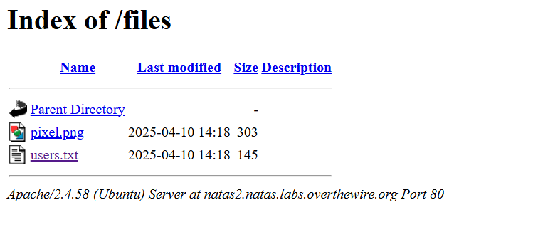

Hope you tried solving the level before checking this walkthrough. Let's start with the basics: view the page source to look for clues. In the source, you'll find an image link. Click to open the image—unfortunately, it doesn't reveal anything useful.

However, notice the presence of a `/files` directory. Try appending `/files` to the URL in your browser. Inside, you'll see two files: a PNG image (the same one from the page source) and a `users.txt` file. Open `users.txt` to find the flag for the next level.

Once you have the flag, proceed to the next level with these credentials:

- **Username:** natas3  
- **URL:** [http://natas3.natas.labs.overthewire.org/](http://natas3.natas.labs.overthewire.org/)  
- **Password:** (the flag you just found)

