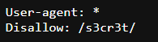

Hope you tried solving the level before checking this walkthrough!

Let's start with the basics: **view the page source** to look for clues. At first glance, there doesn't seem to be anything useful. But wait—what does the comment say? _"Even Google cannot find it."_ That may be a hint.

Google and other search engines use crawlers to index websites. The accessible and inaccessible paths are specified in a `robots.txt` file, which tells search engines what files or directories should not be shown to users.

Let's try accessing `robots.txt` by appending it to the URL. It shows something like this:

It indicates that something is disallowed. While Google won't show it, we can still access it directly. Let's append the disallowed path (after removing `robots.txt`) to the URL. There, we find a file named `users.txt`. Open it.

Woah! We got the password for the next level.

---

Once you have the flag, proceed to the next level with these credentials:

- **Username:** `natas4`
- **URL:** [http://natas4.natas.labs.overthewire.org/](http://natas4.natas.labs.overthewire.org/)
- **Password:** _(The flag you just found)_
